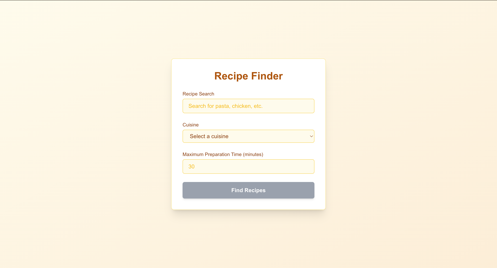
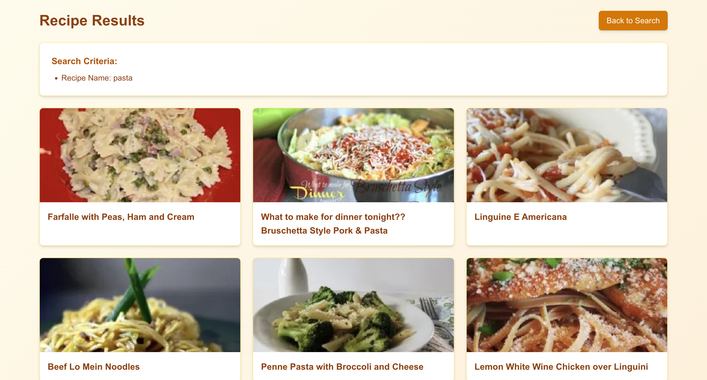
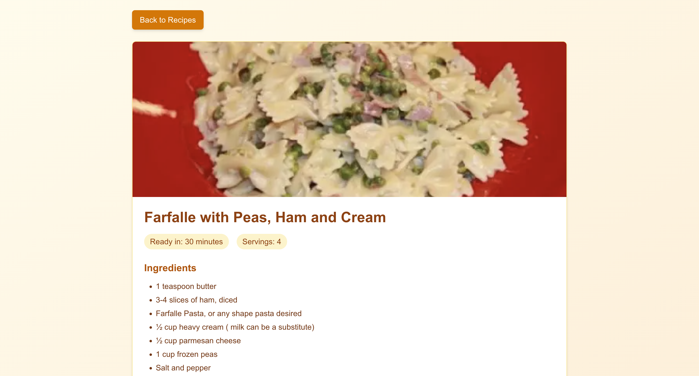

# Recipe App

This is a web application for browsing and viewing recipes. Users can see a list of recipes and view detailed information about each recipe.

## Screenshots





## Technologies Used

- Next.js
- React
- CSS Modules
- Tailwind CSS
- Environment variables for configuration

## Getting Started

### Prerequisites

- Node.js (version 20.x or later recommended)
- npm or yarn

### Installation

1. Clone the repository:

   ```bash
   git clone https://github.com/imrashidov/recipe-finder-app.git
   cd recipe-finder-app
   ```

2. Install dependencies:

   ```bash
   npm install
   # or
   yarn install
   ```

3. Set up environment variables:
   Create a `.env.local` file in the root directory with the following variables:
   ```
   API_URL=your_api_url_here
   # Add any other required environment variables
   ```

### Running the Application

Start the development server:

The application will be available at [http://localhost:3000](http://localhost:3000).

### Building for Production

To build the application for production:

```bash
npm run build
# or
yarn build
```

```bash
npm start
# or
yarn start
```

## Features

- View a list of recipes on the home page
- Click on a recipe to view detailed information
- Responsive design for mobile and desktop

## Project Structure

- `app/page.js`: Main application page
- `app/layout.js`: Layout component used across pages
- `app/recipes/page.js`: Page for displaying all recipes
- `app/recipes/[id]/page.js`: Page for displaying recipe details
- `app/components/`: Directory containing reusable components
  - `Loading.js`: Loading indicator component
  - `RecipesList.js`: Component for displaying the list of recipes
  - `RecipeDetails.js`: Component for displaying recipe details
